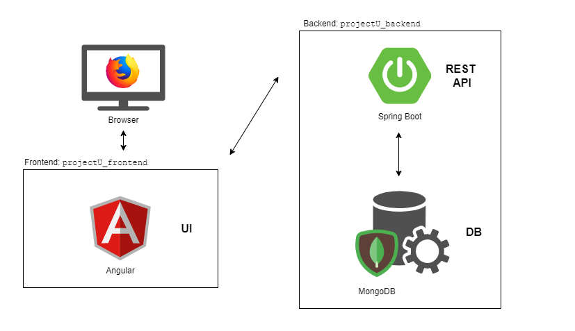

# projectU - Yet Another To Do App


## Introduction
Did you ever had a good idea for a project? Only to forget about it a few days later? Of course you had. Well, its your lucky day because you just found _projectU_ - perhabs the best project managing application in the market, and it's free!

This is the frontend part of this application which is developed with Angular.
The backend part is a RESTful API developed with spring boot on a [separate repository](https://github.com/RonnyFalconeri/projectU_backend).

With projectU you can:

  - Create new projects with various attributes e.g. description, complexity, time estimation and many more
  - Create sub tasks for a project in order to split up the process
  - Keep track of a projects current state and progress
  - Have an overview of every project and its current state

Projects and Tasks are the main objects of projectU. Read the following chapters to understand them more properly.

### What is a Project
A project is the main object of this application. With it you can store your ideas about a cool future (or current) project. 

A project has the following attributes:

  - Title
  - Description
  - State - possible values:
    - initiated
    - in progress
    - halted
    - finished
  - Complexity - possible values:
    - easy
    - medium
    - difficult
  - Estimated duration (in hours)
  - Expected Result / Goal
  - Actual Result
  - Time when the project was created
  - Time when the project was first started
  - Time when the project was finished
  - Tasks (zero or many)

### What is a Task
A task is kind of a "small project". A project can have zero or many tasks. They split up the projects process into smaller and maintainable chunks. Tasks resemble a to do list for a project in order to reach its goal.

A task has the following attributes:

  - Title
  - Description
  - Done - possible values:
    - true
    - false
  - Estimated duration (in hours)
  - Expected Result / Goal


## Demo
GIF of screen using application
Show responsive design


## Technology Used

### Angular & TypeScript
The UI is developed with Angular & TypeScript. This makes up the _projectU_frontend_ which is this repository. This project was generated with [Angular CLI](https://github.com/angular/angular-cli) version 12.1.1.

### Spring Boot & MongoDB
The frontend makes requests to the _projectU_backend_ which is a [separate repository](https://github.com/RonnyFalconeri/projectU_backend). The backend is developed with spring boot and it stores the data in a mongoDB database.

### OpenApi Specification
The API was designed with the contract first approach using the [OpenApi Specification](https://swagger.io/specification/). All the API endpoints with its parameters, responses, objects etc. are defined in a single file called [openapi.yml](./src/assets/openapi/openapi.yaml) which is shared between frontend and backend. With the openapi.yml the corresponding API client & server can be generated using [OpenApi Generators](https://openapi-generator.tech/docs/generators).

### Technology Stack Diagramm



## Getting Started

### Start application
Run `npm start` to generate the api client service from the `openapi.yml`. This will also start the development server automatically afterwards.

If you just want to run the application without having to deal with both separate repositories start the application using docker.

### Build Backend
Instruction to build backend, link to backend repo

### Development server
Run `ng serve` for a dev server. Navigate to `http://localhost:4200/`. The app will automatically reload if you change any of the source files.

### Build
Run `ng build` to build the project. The build artifacts will be stored in the `dist/` directory.

### Running unit tests
Run `ng test` to execute the unit tests via [Karma](https://karma-runner.github.io).

### Static Code Analysis
Run `ng lint` to do a static code analysis. It will detect common code smells, give warnings and or errors.

### Running end-to-end tests
Run `ng e2e` to execute the end-to-end tests via a platform of your choice. To use this command, you need to first add a package that implements end-to-end testing capabilities.

### Further help
To get more help on the Angular CLI use `ng help` or go check out the [Angular CLI Overview and Command Reference](https://angular.io/cli) page.


## Docker
This application can also be run in a docker container.
You will need to have _docker_ and _docker-compose_ installed on your system.
To start the entire application, do the following steps:

1. Create a `docker-compose.yml` file
2. Copy the following code into the `docker-compose.yml` file:

``` yml
version: '3.7'

services:

  app-frontend:
    container_name: app-frontend
    build:
      context: .
    ports:
      - "8081:80"
    restart: always
    networks:
      - frontend

networks:
  frontend:
```

3. Run the command 
```
docker-compose up
```
Both the frontend and backend have their own `Dockerfile`. The `docker-compose.yml` will pick these up and create docker images.
The two repositories get downloaded and copied into the docker images and automatically started as containers.

You should now be able to open the application in your browser with http://localhost:8081.


## Releases

### v1.0.0
- View every project
- View every task
- Switch view between multiple tasks of a project
- Create, edit, delete projects
- Create, edit, delete tasks
